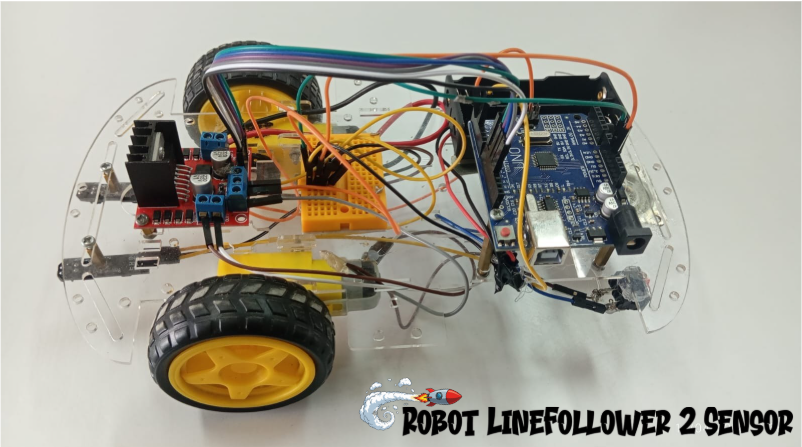

# 🤖 Robot Line Follower 2 Sensor

Project ini merupakan simulasi dan implementasi robot line follower berbasis Arduino yang menggunakan 2 sensor infrared (IR) sebagai pendeteksi jalur. Robot dirancang untuk mampu mengikuti garis secara otomatis dengan membaca perbedaan warna permukaan (hitam dan putih).

## 📸 Tampilan Robot

## 📌 Deskripsi
Sistem bekerja dengan memanfaatkan dua sensor infrared yang dipasang pada sisi kiri dan kanan robot. Sensor akan mendeteksi keberadaan garis, kemudian mengirimkan data ke mikrokontroler Arduino untuk diproses.

Berdasarkan hasil pembacaan sensor:
- Robot akan bergerak maju ketika kedua sensor berada pada jalur
- Robot akan berbelok ke kiri atau kanan sesuai dengan kondisi deteksi garis
- Robot mampu menyesuaikan arah secara otomatis agar tetap berada di jalur

## ⚙️ Komponen yang Digunakan
- Arduino Uno
- 2 Sensor Infrared (IR)
- Motor DC
- Driver Motor L298N
- Rangka dan roda robot

## 🧠 Cara Kerja Sistem
Sensor infrared membaca perbedaan warna pada permukaan lintasan. Data dari sensor diproses oleh Arduino untuk mengontrol arah dan kecepatan motor melalui driver L298N, sehingga robot dapat mengikuti jalur secara stabil.

## 📂 Isi Repository
- Source code Arduino
- Diagram rangkaian
- Gambar robot
- Video hasil pengujian

## 👨‍💻 Author
Muhammad Reki  
Program Studi Teknologi Rekayasa

